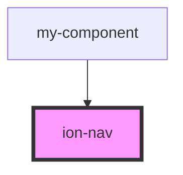

# ion-nav

<!-- Auto Generated Below -->

## Properties

| Property       | Attribute       | Description                                                                                                                                                                                      | Type      | Default     |
| -------------- | --------------- | ------------------------------------------------------------------------------------------------------------------------------------------------------------------------------------------------ | --------- | ----------- |
| `animated`     | `animated`      | If `true`, the nav should animate the transition of components.                                                                                                                                  | `boolean` | `true`      |
| `animation`    | `animation`     | By default `ion-nav` animates transition between pages based in the mode (ios or material design). However, this property allows to create custom transition using `AnimationBuilder` functions. | `any`     | `undefined` |
| `root`         | `root`          | Root NavComponent to load                                                                                                                                                                        | `any`     | `undefined` |
| `rootParams`   | `root-params`   | Any parameters for the root component                                                                                                                                                            | `any`     | `undefined` |
| `swipeGesture` | `swipe-gesture` | If the nav component should allow for swipe-to-go-back.                                                                                                                                          | `boolean` | `undefined` |

## Events

| Event              | Description                                     | Type                |
| ------------------ | ----------------------------------------------- | ------------------- |
| `ionNavDidChange`  | Event fired when the nav has changed components | `CustomEvent<void>` |
| `ionNavWillChange` | Event fired when the nav will change components | `CustomEvent<void>` |

## Methods

### `canGoBack(view?: ViewController) => Promise<boolean>`

Returns `true` if the current view can go back.

#### Parameters

| Name   | Type  | Description        |
| ------ | ----- | ------------------ |
| `view` | `any` | The view to check. |

#### Returns

Type: `Promise<boolean>`

### `getActive() => Promise<ViewController | undefined>`

Get the active view.

#### Returns

Type: `Promise<any>`

### `getByIndex(index: number) => Promise<ViewController | undefined>`

Get the view at the specified index.

#### Parameters

| Name    | Type     | Description            |
| ------- | -------- | ---------------------- |
| `index` | `number` | The index of the view. |

#### Returns

Type: `Promise<any>`

### `getPrevious(view?: ViewController) => Promise<ViewController | undefined>`

Get the previous view.

#### Parameters

| Name   | Type  | Description      |
| ------ | ----- | ---------------- |
| `view` | `any` | The view to get. |

#### Returns

Type: `Promise<any>`

### `insert<T extends unknown>(insertIndex: number, component: T, componentProps?: any | null, opts?: NavOptions | null, done?: TransitionDoneFn) => Promise<boolean>`

Inserts a component into the navigation stack at the specified index.
This is useful to add a component at any point in the navigation stack.

#### Parameters

| Name             | Type     | Description                                        |
| ---------------- | -------- | -------------------------------------------------- |
| `insertIndex`    | `number` | The index to insert the component at in the stack. |
| `component`      | `T`      | The component to insert into the navigation stack. |
| `componentProps` | `any`    | Any properties of the component.                   |
| `opts`           | `any`    | The navigation options.                            |
| `done`           | `any`    | The transition complete function.                  |

#### Returns

Type: `Promise<boolean>`

### `insertPages(insertIndex: number, insertComponents: any, opts?: NavOptions | null, done?: TransitionDoneFn) => Promise<boolean>`

Inserts an array of components into the navigation stack at the specified index.
The last component in the array will become instantiated as a view, and animate
in to become the active view.

#### Parameters

| Name               | Type     | Description                                         |
| ------------------ | -------- | --------------------------------------------------- |
| `insertIndex`      | `number` | The index to insert the components at in the stack. |
| `insertComponents` | `any`    | The components to insert into the navigation stack. |
| `opts`             | `any`    | The navigation options.                             |
| `done`             | `any`    | The transition complete function.                   |

#### Returns

Type: `Promise<boolean>`

### `pop(opts?: NavOptions | null, done?: TransitionDoneFn) => Promise<boolean>`

Pop a component off of the navigation stack. Navigates back from the current
component.

#### Parameters

| Name   | Type  | Description                       |
| ------ | ----- | --------------------------------- |
| `opts` | `any` | The navigation options.           |
| `done` | `any` | The transition complete function. |

#### Returns

Type: `Promise<boolean>`

### `popTo(indexOrViewCtrl: number | ViewController, opts?: NavOptions | null, done?: TransitionDoneFn) => Promise<boolean>`

Pop to a specific index in the navigation stack.

#### Parameters

| Name              | Type  | Description                             |
| ----------------- | ----- | --------------------------------------- |
| `indexOrViewCtrl` | `any` | The index or view controller to pop to. |
| `opts`            | `any` | The navigation options.                 |
| `done`            | `any` | The transition complete function.       |

#### Returns

Type: `Promise<boolean>`

### `popToRoot(opts?: NavOptions | null, done?: TransitionDoneFn) => Promise<boolean>`

Navigate back to the root of the stack, no matter how far back that is.

#### Parameters

| Name   | Type  | Description                       |
| ------ | ----- | --------------------------------- |
| `opts` | `any` | The navigation options.           |
| `done` | `any` | The transition complete function. |

#### Returns

Type: `Promise<boolean>`

### `push<T extends unknown>(component: T, componentProps?: any | null, opts?: NavOptions | null, done?: TransitionDoneFn) => Promise<boolean>`

Push a new component onto the current navigation stack. Pass any additional
information along as an object. This additional information is accessible
through NavParams.

#### Parameters

| Name             | Type  | Description                                      |
| ---------------- | ----- | ------------------------------------------------ |
| `component`      | `T`   | The component to push onto the navigation stack. |
| `componentProps` | `any` | Any properties of the component.                 |
| `opts`           | `any` | The navigation options.                          |
| `done`           | `any` | The transition complete function.                |

#### Returns

Type: `Promise<boolean>`

### `removeIndex(startIndex: number, removeCount?: number, opts?: NavOptions | null, done?: TransitionDoneFn) => Promise<boolean>`

Removes a component from the navigation stack at the specified index.

#### Parameters

| Name          | Type     | Description                         |
| ------------- | -------- | ----------------------------------- |
| `startIndex`  | `number` | The number to begin removal at.     |
| `removeCount` | `number` | The number of components to remove. |
| `opts`        | `any`    | The navigation options.             |
| `done`        | `any`    | The transition complete function.   |

#### Returns

Type: `Promise<boolean>`

### `setPages(views: NavComponent[] | NavComponentWithProps[], opts?: NavOptions | null, done?: TransitionDoneFn) => Promise<boolean>`

Set the views of the current navigation stack and navigate to the last view.
By default animations are disabled, but they can be enabled by passing options
to the navigation controller. Navigation parameters can also be passed to the
individual pages in the array.

#### Parameters

| Name    | Type    | Description                                       |
| ------- | ------- | ------------------------------------------------- |
| `views` | `any[]` | The list of views to set as the navigation stack. |
| `opts`  | `any`   | The navigation options.                           |
| `done`  | `any`   | The transition complete function.                 |

#### Returns

Type: `Promise<boolean>`

### `setRoot<T extends unknown>(component: T, componentProps?: any | null, opts?: NavOptions | null, done?: TransitionDoneFn) => Promise<boolean>`

Set the root for the current navigation stack to a component.

#### Parameters

| Name             | Type  | Description                                               |
| ---------------- | ----- | --------------------------------------------------------- |
| `component`      | `T`   | The component to set as the root of the navigation stack. |
| `componentProps` | `any` | Any properties of the component.                          |
| `opts`           | `any` | The navigation options.                                   |
| `done`           | `any` | The transition complete function.                         |

#### Returns

Type: `Promise<boolean>`

## Dependencies

### Used by

 - [my-component](../my-component)

### Graph

----------------------------------------------

*Built with [StencilJS](https://stenciljs.com/)*
