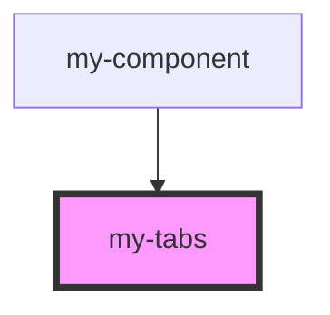

# my-tabs

<!-- Auto Generated Below -->

## Events

| Event               | Description                                                                | Type                            |
| ------------------- | -------------------------------------------------------------------------- | ------------------------------- |
| `ionTabsDidChange`  | Emitted when the navigation has finished transitioning to a new component. | `CustomEvent<{ tab: string; }>` |
| `ionTabsWillChange` | Emitted when the navigation is about to transition to a new component.     | `CustomEvent<{ tab: string; }>` |

## Methods

### `getSelected() => Promise<string | undefined>`

Get the currently selected tab. This method is only available for vanilla JavaScript projects. The Angular, React, and Vue implementations of tabs are coupled to each framework's router.

#### Returns

Type: `Promise<string>`

### `getTab(tab: string | HTMLIonTabElement) => Promise<HTMLIonTabElement | undefined>`

Get a specific tab by the value of its `tab` property or an element reference. This method is only available for vanilla JavaScript projects. The Angular, React, and Vue implementations of tabs are coupled to each framework's router.

#### Parameters

| Name  | Type  | Description                                                                                         |
| ----- | ----- | --------------------------------------------------------------------------------------------------- |
| `tab` | `any` | The tab instance to select. If passed a string, it should be the value of the tab's `tab` property. |

#### Returns

Type: `Promise<any>`

### `select(tab: string | HTMLIonTabElement) => Promise<boolean>`

Select a tab by the value of its `tab` property or an element reference. This method is only available for vanilla JavaScript projects. The Angular, React, and Vue implementations of tabs are coupled to each framework's router.

#### Parameters

| Name  | Type  | Description                                                                                         |
| ----- | ----- | --------------------------------------------------------------------------------------------------- |
| `tab` | `any` | The tab instance to select. If passed a string, it should be the value of the tab's `tab` property. |

#### Returns

Type: `Promise<boolean>`

## Slots

| Slot       | Description                                                           |
| ---------- | --------------------------------------------------------------------- |
|            | Content is placed between the named slots if provided without a slot. |
| `"bottom"` | Content is placed at the bottom of the screen.                        |
| `"top"`    | Content is placed at the top of the screen.                           |

## Dependencies

### Used by

 - [my-component](../my-component)

### Graph

----------------------------------------------

*Built with [StencilJS](https://stenciljs.com/)*
